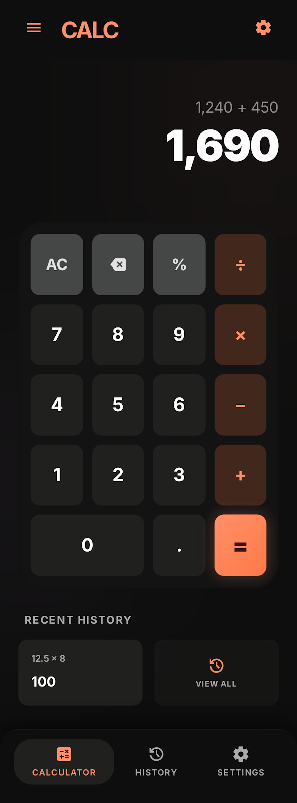
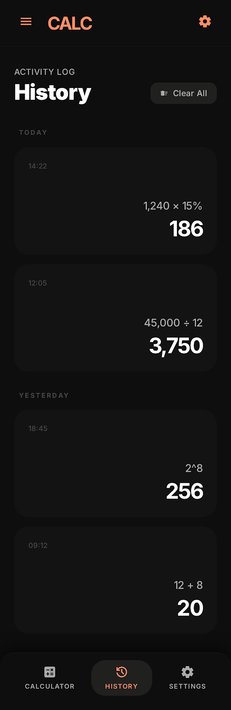

# CALC - Calculadora Web

Aplicacion web de calculadora con interfaz moderna, historial de operaciones y navegacion por pestañas.

## Descripcion

Este proyecto implementa una calculadora digital en una sola pagina.
Permite realizar operaciones basicas, guardar historial y consultar resultados recientes desde una interfaz pensada para dispositivos moviles.

## Caracteristicas

- Operaciones basicas: suma, resta, multiplicacion, division y porcentaje.
- Soporte de numeros decimales.
- Botones de utilidad: AC (reiniciar), borrar ultimo digito, igual.
- Historial persistente con LocalStorage.
- Vista de historial agrupada por fecha (Today, Yesterday).
- Tarjeta de Recent History en la vista principal.
- Navegacion inferior entre Calculator, History y Settings.
- Interfaz responsive con estilo oscuro.

## Tecnologias

- HTML5
- CSS3
- JavaScript (Vanilla)
- Tailwind CSS via CDN
- Google Fonts (Inter)
- Material Symbols Outlined

## Estructura del proyecto

- index.html: estructura principal de la app y layout.
- scripts.js: logica de calculadora, historial y navegacion de pestañas.
- styles/index.css: estilos personalizados del proyecto.
- calculator.png: referencia visual de la vista de calculadora.
- history.png: referencia visual de la vista de historial.

## Como ejecutar el proyecto

1. Clona o descarga el repositorio.
2. Abre la carpeta del proyecto en VS Code.
3. Abre el archivo index.html en tu navegador.

No requiere instalacion de dependencias ni proceso de build.

## Capturas

### Vista Calculadora

### Vista Historial

## Estado del proyecto

Proyecto academico en desarrollo.
La base funcional de operaciones y persistencia de historial ya se encuentra implementada.
